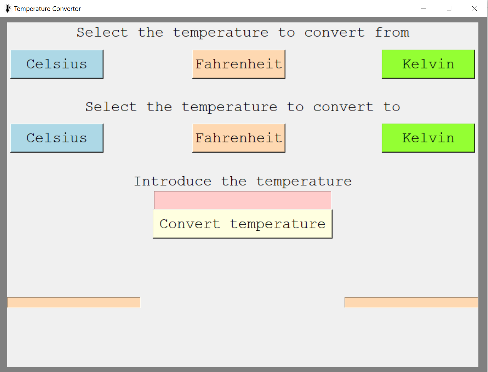
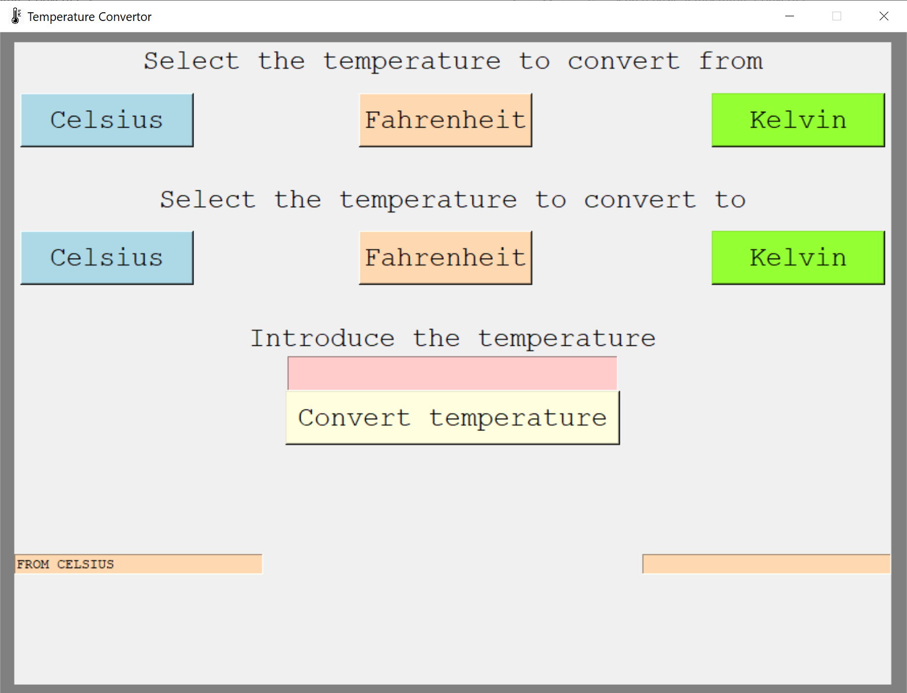
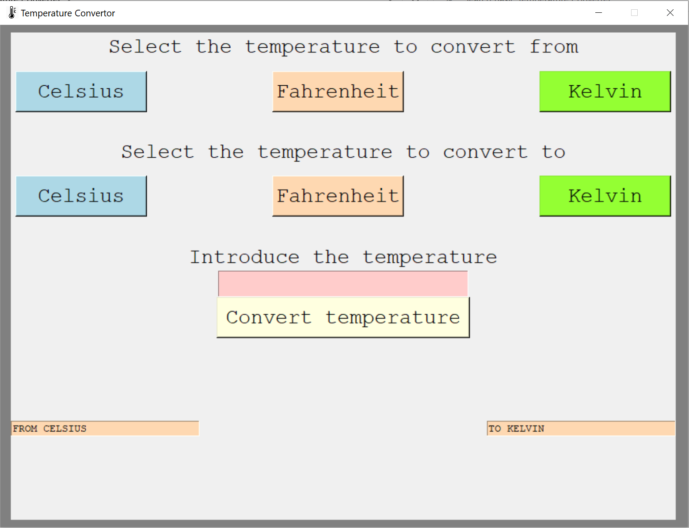
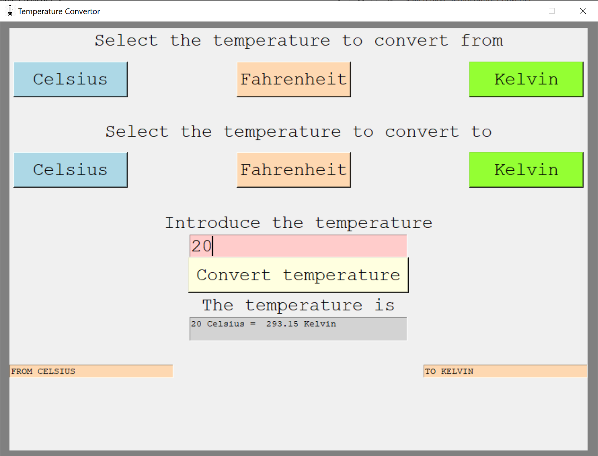

This project is a Basic Temperature Converter (Celsius/Fahrenheit/Kelvin) Using Tkinter.

The user can use the application to convert between the temperatures available in the project.

The user can see the temperatures that were selected and the final calculation will be shown after the user
will press the button to convert.

